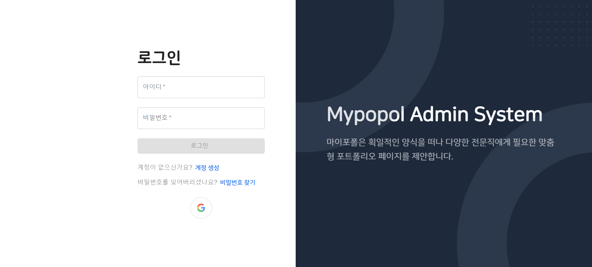

# MyPopol

링크 : [https://admin.mypopol.com](https://admin.mypopol.com)

## 1. 서비스 소개

- 직업별 맞춤 포트폴리오 사이트 제공 
- 포트폴리오 사이트 정보 수정 
- 나의 사이트 방문자 수, 사이트를 통한 이메일 발신 수 확인
- 제공된 포트폴리오 사이트 메일 양식으로 방문자의 메일 수신  

## 2. 사용 기술

## 3. 제공 템플릿

### 웹툰 & 웹소설 작가를 위한 포트폴리오 사이트 

- [미리보기](https://site.mypopol.com/ptid01/example)

 
 

### 개발자를 위한 포트폴리오 사이트

- [미리보기](https://site.mypopol.com/ptid01/example)

 
 